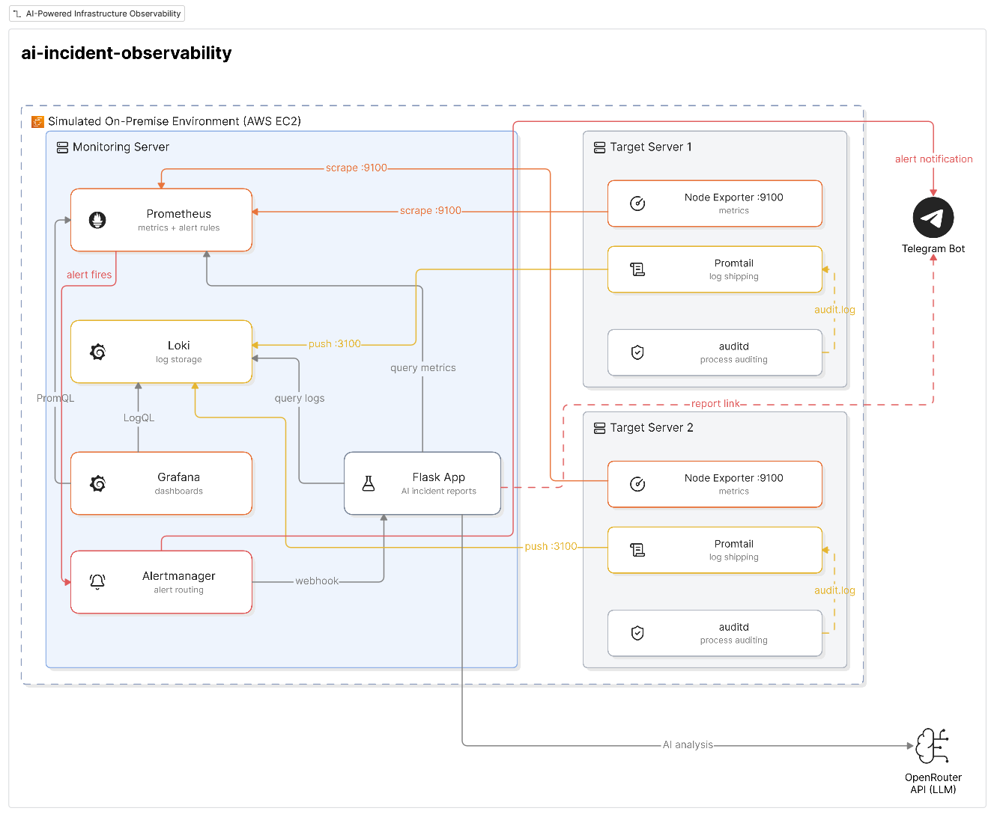
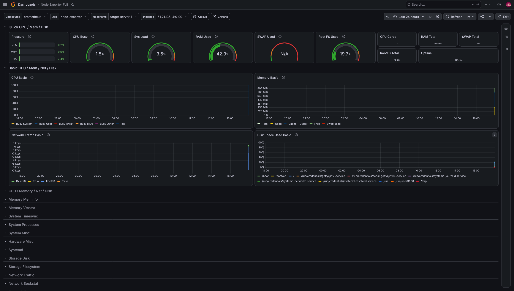
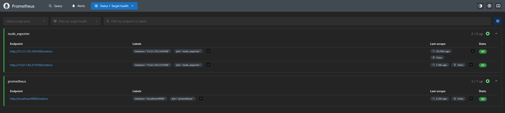
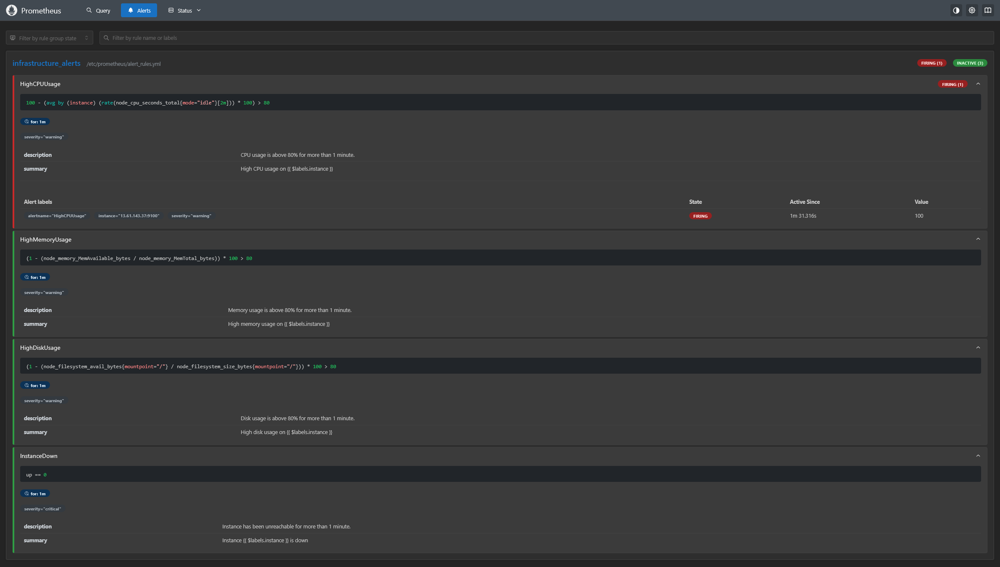
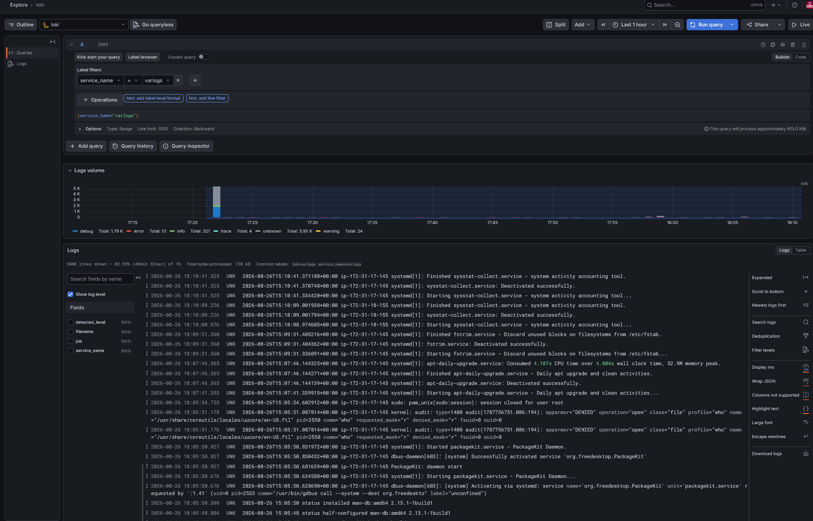
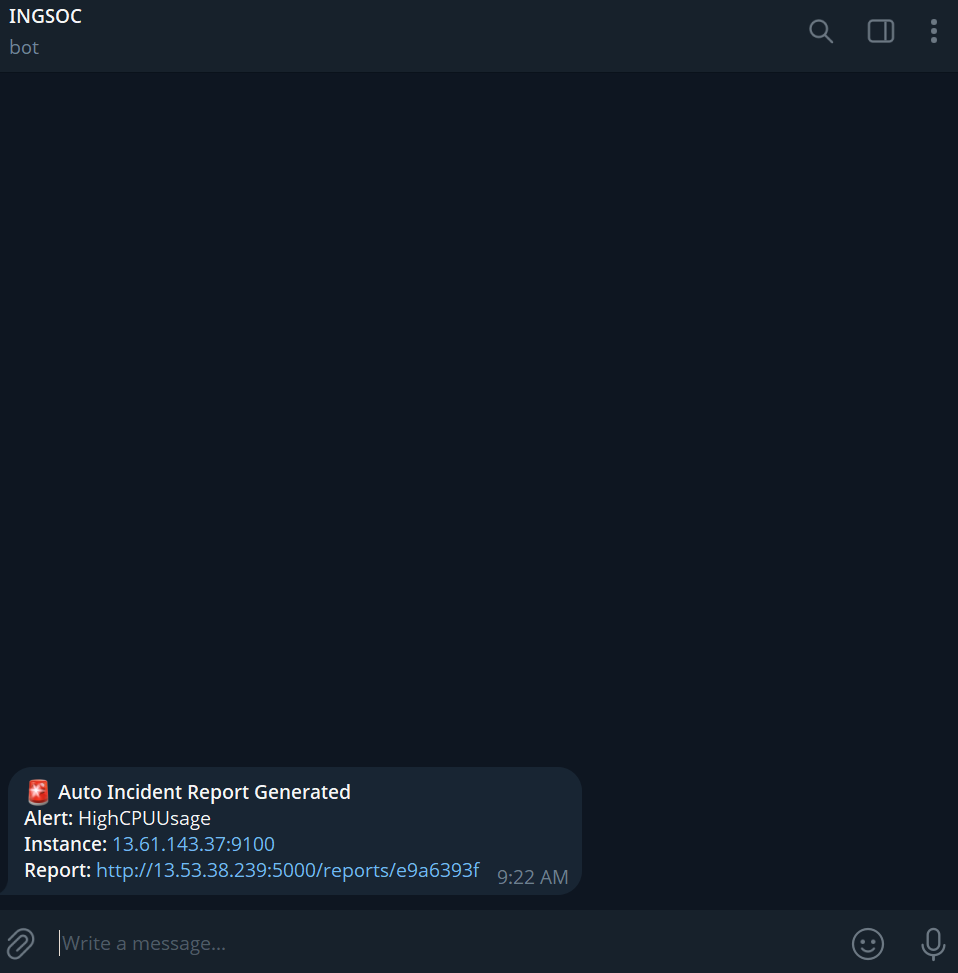
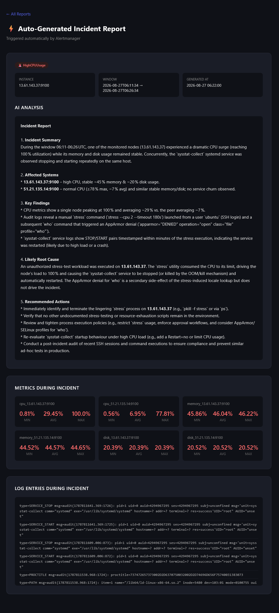

# Infrastructure Observability PoC with AI Incident Reports


A centralized monitoring, logging and alerting stack for Linux servers, with an AI service that turns every alert into a written incident report.

Built during my COOP training (2026) as a proof of concept for an on-premise environment. It ran on my own AWS account, with EC2 test servers standing in for on-premise machines; no organisational systems or data were involved. The stack itself is cloud-agnostic and runs anywhere Docker runs.



## The brief

Requirements:

- One central view of server health, instead of logging into each machine.
- A warning before a server runs out of CPU, memory or disk, and when one goes down.
- A written record of each incident: what happened, the likely cause, what to do next.

Constraints:

- Free and open source components.
- Deployable fully on-premise, with no dependency on paid SaaS. The one exception in this PoC is the LLM call, which uses an external API (see Known limitations).

## What it does

1. **Metrics**: Node Exporter on each server exposes CPU, memory, disk and network. Prometheus scrapes them every 15 seconds.
2. **Logs**: Promtail ships system logs and auditd logs from each server to Loki.
3. **Dashboards**: Grafana shows both servers live (Node Exporter Full dashboard).
4. **Alerting**: Four Prometheus rules (CPU, memory, disk above 80% for 1 minute; instance down for 1 minute) route through Alertmanager to Telegram.
5. **AI incident reports**: Alertmanager also calls a Flask webhook. The service pulls the metrics and logs from 10 minutes before the alert up to 5 minutes after it (capped at the moment the report is generated), sends them to an LLM, and publishes a structured report (summary, affected systems, findings, root cause, recommended actions). The link is posted to Telegram.
6. **Root-cause evidence**: An auditd rule records process executions, so the report can cite the exact command behind a spike instead of guessing.

## Case study: catching a real SSH scan

During testing an alert fired that I had not triggered. The generated report identified repeated SSH connections from several external hosting-provider IPs that closed before authentication, distinguished them from a legitimate key-based login, concluded there was no compromise, and recommended Fail2Ban, restricting port 22 by source, and confirming `PasswordAuthentication no`.

Full report (IPs of my own machine and key fingerprints redacted): [docs/sample-report-ssh-scanning.txt](docs/sample-report-ssh-scanning.txt)

## Screenshots

| Grafana dashboard                           | Prometheus targets                           |
| ------------------------------------------- | -------------------------------------------- |
|   |  |
| **Firing alert**                            | **Logs in Loki**                             |
|  |           |
| **Telegram notification**                   | **Generated report**                         |
|     |     |

## Stack

| Component         | Role                                    | Port |
| ----------------- | --------------------------------------- | ---- |
| Prometheus        | Metrics scraping, alert rules           | 9090 |
| Alertmanager      | Alert routing (Telegram + webhook)      | 9093 |
| Grafana           | Dashboards                              | 3000 |
| Loki              | Log storage                             | 3100 |
| Promtail          | Log shipping (on targets)               |      |
| Node Exporter     | Host metrics (on targets)               | 9100 |
| Incident Reporter | Flask + OpenRouter LLM                  | 5000 |
| auditd            | Process execution auditing (on targets) |      |

## Repository layout

```
monitoring-server/     Prometheus, Alertmanager, Loki, Grafana (docker compose)
target-server/         Node Exporter, Promtail, auditd rule
incident-reporter/     Flask service, templates, tests, Dockerfile
terraform/             AWS provisioning: 3 EC2 instances, security groups, bootstrap scripts
.github/workflows/     CI: lint, tests, Docker build, config and Terraform validation
docs/                  Screenshots and a sample generated report
.env.example           All secrets and URLs, as placeholders
```

## Deploy with Terraform

```bash
cp .env.example .env                       # fill in secrets
cd terraform
cp terraform.tfvars.example terraform.tfvars   # set admin_cidr and repo_url
terraform init && terraform apply
```

This creates the monitoring server, two targets and least-privilege security groups (admin IP only for SSH and UIs; 9100 only from monitoring; 3100 only from targets). The targets bootstrap themselves: Docker, Node Exporter, Promtail, auditd rule and SSH hardening. Secrets are not passed through user data, since it is readable from instance metadata. Set `APP_BASE_URL` in `.env` to the `monitoring_public_ip` output, then finish with the two commands printed in the `next_steps` output, which copy `.env` and the generated Prometheus config to the monitoring server and start the stack.

`terraform destroy` removes everything.

## Manual setup

Requirements: three Linux hosts (one monitoring, two targets) with Docker and Docker Compose. Ubuntu 24.04 was used. A t3.small or larger is recommended for the monitoring host; t2.micro ran out of memory.

**1. Monitoring server**

```bash
git clone https://github.com/173p/ai-incident-observability.git
cd ai-incident-observability
cp .env.example .env        # fill in real values
# set target IPs in monitoring-server/prometheus/prometheus.yml
cd monitoring-server
docker compose --env-file ../.env up -d
```

Open Grafana on port 3000 and import dashboard ID `1860`.

**2. Each target server**

```bash
cd ai-incident-observability/target-server
# set the monitoring server IP in promtail/promtail-config.yml
# set the hostname in docker-compose.yml (target-server-1 / target-server-2)
docker compose up -d

sudo apt install -y auditd
sudo cp audit/stress.rules /etc/audit/rules.d/
sudo augenrules --load
```

**3. Network / firewall**

| Host       | Inbound                                                          |
| ---------- | ---------------------------------------------------------------- |
| Monitoring | 22, 3000, 9090, 9093, 5000 from your admin IP; 3100 from targets |
| Targets    | 22 from admin IP; 9100 from monitoring server                    |

Metrics are pulled (monitoring to target on 9100); logs are pushed (target to monitoring on 3100). Both directions need rules.

**4. Test**

```bash
sudo apt install -y stress
stress --cpu 2 --timeout 180s
```

Within about two minutes: an alert in Telegram, then a link to a report that cites the `stress` command from the audit log.

## Tests and CI

```bash
cd incident-reporter
pip install -r requirements-dev.txt
pytest -q
```

Tests cover the bugs listed below: epoch timestamps sent to Prometheus, LLM error responses without `choices`, the cooldown, and markdown rendering (including HTML escaping of the LLM output). CI also runs `promtool` on the alert rules, `amtool` on the Alertmanager config, and `terraform fmt` and `validate`.

## Environment variables

| Variable                                       | Purpose                              |
| ---------------------------------------------- | ------------------------------------ |
| `TELEGRAM_BOT_TOKEN`, `TELEGRAM_CHAT_ID`       | Telegram notifications               |
| `OPENROUTER_API_KEY`, `OPENROUTER_MODEL`       | LLM for reports                      |
| `PROMETHEUS_URL`, `LOKI_URL`                   | Data sources for the reporter        |
| `APP_BASE_URL`                                 | Public base URL used in report links |
| `GRAFANA_ADMIN_USER`, `GRAFANA_ADMIN_PASSWORD` | Grafana login                        |

## Lessons learned (bugs worth remembering)

- **Silent empty results.** Prometheus accepted naive ISO timestamps without an error but returned nothing, so every report looked empty for an unrelated reason. Fix: send epoch seconds. Lesson: verify what an external API actually returns.
- **Pull vs push.** Metrics are pulled by Prometheus, logs are pushed by Promtail, so firewall rules are needed in opposite directions.
- **Promtail config typo.** A wrong key (`lastlog:` instead of `__path__`) silently disabled collection. Then `/var/log/lastlog`, a sparse binary file, produced entries larger than Loki accepts, so it is excluded.
- **Narrow log query.** The reporter originally queried only system logs, so the AI never saw audit evidence. Fix: `{job=~"varlogs|auditlogs"}`.
- **Hardcoded IPs.** Public IPs change after a stop/start, which broke report links and once had me testing the wrong instance. Fix: `APP_BASE_URL` and private IPs everywhere internal.
- **LLM routing.** A free auto-router occasionally returned a safety classifier verdict instead of a report. Fix: pin a model and validate the response shape before reading it.
- **Alert fatigue.** Added a 30-minute cooldown per alert and instance, and an inhibition rule so "instance down" suppresses that host's warnings.
- **Shared infrastructure.** Stressing one target once triggered a false alert on the other. A monitoring system on the same infrastructure it watches can fail with it.

## Known limitations

This is a proof of concept, not production-ready:

- Reports are stored in memory and lost on restart.
- No authentication or HTTPS on the reporter or exposed ports.
- Monitoring is co-located with what it monitors (single point of failure).
- The Loki query is not scoped to the alerting host.
- The AI can only infer intent when audit evidence exists; otherwise it can only describe symptoms.
- Log data is sent to an external LLM API, which a real on-premise deployment would replace with a self-hosted model.

## Roadmap

- Persist reports (SQLite or PostgreSQL)
- Reverse proxy with TLS and authentication (MFA)
- Self-hosted LLM to keep logs on-premise
- Scope log queries to the alerting instance
- Remote Terraform state (S3 with locking)
- Run monitoring in a separate failure domain from the targets

## Note on this repository

The original servers were decommissioned after the project. Configuration and code here were rebuilt from the project documentation, with all secrets moved to environment variables.
